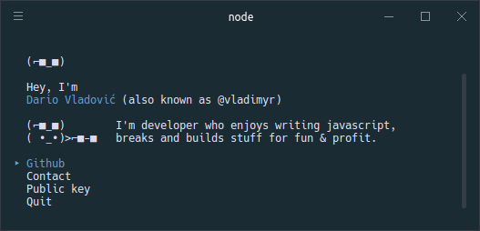

# vladimyr [](https://travis-ci.com/vladimyr/vladimyr) [](https://npm.im/vladimyr) [](https://github.com/vladimyr/vladimyr/blob/master/LICENSE)

> vladimyr's CLI



## Usage

Install Node.js, then:

```
$ npx vladimyr
```

## Acknowledgments

Inspired by @sindresorhus's awesome [CLI](https://github.com/sindresorhus/sindresorhus).
